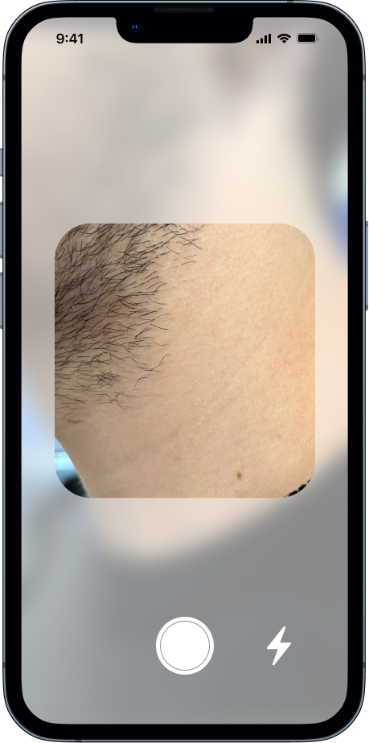

<h1 align="center">Hi 👋, I'm Michele Zurlo</h1>

- 🌱 I’m currently a Computer Science student and enrolled in the Apple Developer Academy Program.

- 📫 How to reach me **zurlomichele@icloud.com**

- 📄 Know about my experiences [resume](https://europa.eu/europass/eportfolio/screen/share/5efc95ee-88e1-437b-8104-bf3871a291d0?lang=it)

<h3 align="left">Connect with me:</h3>

<!-- # Hello!
*Thanks for stopping by*. This repo serves as a kind of ever-changing portfolio of projects I'm currently excited about; please feel free to look around. -->

# My projects

## 5 Dots
5 Dots is an iOS app, designed to support users become more self-aware by allowing them to record their daily thoughts and feelings, in the form of a card. Users can also view their entries thorugh a calendar feature, which displays the card for each day.

The app is being developed with my team composed by 2 developers, 2 designers and 1 Team Lead.
I was one of the devoloper of the team and I also followed the design process.
We started from a desk research about mental health/mental well-being and then with our app ,we found out a way to support people became more self aware.

&nbsp;&nbsp;&nbsp;&nbsp;&nbsp;&nbsp;&nbsp;&nbsp;&nbsp;&nbsp;

## Veggie's Attack
Get ready for an out-of-this-world experience with "Veggie's Attack"! Join the cosmic battle against mischievous vegetables in this thrilling space shooter. As a fearless bald man, it's up to you to save the universe from an invasion of flying veggies!

Features:
 - Engaging and addictive space shooter gameplay with a twist.
 - Take control of a bald man in an epic battle against mischievous veggies.
 - Unique vegetable adversaries with varied abilities and attack patterns.
 - Explore breathtaking interstellar landscapes and vibrant space environments.
 - Unleash devastating power-ups to turn the tide in your favor.
 - Easy-to-learn controls that offer precise maneuverability.

Try it on the AppStore: https://apps.apple.com/it/app/veggies-attack/id6446289776?l=en

Try it on TestFlight: https://testflight.apple.com/join/pV5LV0Ia

<!-- &nbsp;&nbsp;&nbsp;&nbsp;&nbsp;&nbsp;&nbsp;&nbsp;&nbsp;&nbsp;&nbsp;&nbsp;&nbsp;&nbsp;&nbsp;&nbsp;&nbsp;&nbsp;&nbsp;&nbsp;   -->

&nbsp;&nbsp;&nbsp;&nbsp;&nbsp;&nbsp;&nbsp;&nbsp;&nbsp;&nbsp;&nbsp;&nbsp;&nbsp;&nbsp;&nbsp;&nbsp;

## Neutone

Neutone is an app designed specifically for makeup artists and anyone looking to find the perfect foundation match for their skin undertone. This app uses a machine learning model to accurately detect the skin undertone..With Neutone, users can take a simple photo and receive as result their skin undertone. This eliminates the guesswork and frustration often associated with finding the perfect shade of makeup, saving time and money in the process.
Whether you're a seasoned makeup artist or a beauty enthusiast, Neutone is the right tool for you.

Try it on TestFlight: https://testflight.apple.com/join/BKQQ2dE9

<!-- &nbsp;&nbsp;&nbsp;&nbsp;&nbsp;&nbsp;&nbsp;&nbsp;&nbsp;&nbsp;&nbsp;&nbsp;&nbsp;&nbsp;&nbsp;&nbsp;&nbsp;&nbsp;&nbsp;&nbsp; -->

Framework used:

&nbsp;&nbsp;&nbsp;&nbsp;&nbsp;&nbsp;&nbsp;&nbsp;&nbsp;&nbsp;&nbsp;&nbsp;&nbsp;&nbsp;&nbsp;&nbsp;

<h3 align="left">Languages and Tools that I used:</h3>

                   

